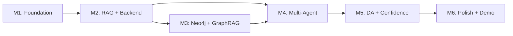

# AEGIS — Development Roadmap

> **Created:** 2026-06-26
> **Status:** Active
> **Baseline:** Integrated from both source documents, improved with optimized ordering

---

## Overview

The roadmap is organized into **6 milestones** that build progressively. Each milestone produces a working, demonstrable increment. The ordering prioritizes establishing the integration contract (shared schemas) first, then building both sides (AI core + platform) in parallel.

### Timeline Summary

```
Milestone 1: Foundation & Contracts        ──── Week 1-2
Milestone 2: RAG Pipeline & Basic Backend  ──── Week 3-5
Milestone 3: Neo4j & GraphRAG             ──── Week 5-7
Milestone 4: Multi-Agent Orchestration     ──── Week 7-10
Milestone 5: Adversarial Loop & Confidence ──── Week 10-13
Milestone 6: Integration, Polish & Demo    ──── Week 13-16
```

---

## Milestone 1: Foundation & Contracts

> **Objective:** Set up the development environment, establish shared contracts, and create the skeleton codebase that both team members will build on.

### Deliverables

| Deliverable | Owner | Description |
|------------|-------|-------------|
| Repository structure | Both | Create full directory structure per GIT_WORKFLOW.md |
| Docker Compose | Aditya | Backend + Neo4j + frontend containers running |
| `shared/schemas.py` | Both | All Pydantic models: `AgentRequest`, `AgentResponse`, `Claim`, `SourceCitation`, `WSMessage` |
| `shared/constants.py` | Both | Source tiers, model names, config constants |
| FastAPI skeleton | Aditya | `main.py` with health check, CORS, basic routing |
| React skeleton | Aditya | Vite project initialized, basic layout, routing |
| Supabase project | Aditya | Create project, configure auth, initial schema |
| `.env.example` | Both | All required environment variables documented |
| GCP service account | Shlok | Vertex AI enabled, service account key generated |
| CI/CD pipeline | Aditya | GitHub Actions: lint + test (even if tests are empty) |
| Base Agent class | Shlok | `agents/base.py` with abstract interface |
| Mock agent | Shlok | Stub agent that returns hardcoded `AgentResponse` |

### Dependencies
- GCP project with Vertex AI API enabled
- Supabase project created
- GitHub repository set up with branch structure

### Risks

| Risk | Mitigation |
|------|-----------|
| GCP credit activation delay | Start GCP setup on day 1 |
| Supabase free tier limits | Design schema to minimize row count |
| Schema disagreements | Pair-design the schemas in session together |

### Testing Criteria
- [ ] `docker-compose up` starts all services without errors
- [ ] `GET /health` returns 200
- [ ] Mock agent returns valid `AgentResponse` JSON
- [ ] Frontend loads in browser at `localhost:3000`
- [ ] Supabase auth signup/login works
- [ ] GitHub Actions CI passes on push

### Definition of Done
All team members can run the full stack locally, submit a query that hits the mock agent, and see a response in the frontend.

---

## Milestone 2: RAG Pipeline & Basic Backend

> **Objective:** Implement the core RAG retrieval pipeline (ChromaDB + Vertex AI embeddings) and connect the first real agent (Recon) to the backend API.

### Deliverables

| Deliverable | Owner | Description |
|------------|-------|-------------|
| Vertex AI embedding client | Shlok | `retrieval/embeddings.py` — batch + query embedding via text-embedding-005 |
| Document chunking | Shlok | `retrieval/chunking.py` — 500-token chunks with overlap |
| ChromaDB vector store | Shlok | `retrieval/vector_store.py` — collection management, add/query |
| Document ingestion pipeline | Shlok | `retrieval/ingestion.py` — process PDFs/text → chunks → embed → store |
| Demo corpus | Shlok | 20-50 documents (policy PDFs, news articles, SEC filings) |
| Recon Agent (v1) | Shlok | Working agent with DuckDuckGo search + ChromaDB RAG |
| Query API endpoint | Aditya | `POST /api/query` — accepts query, calls orchestrator, returns result |
| Query history | Aditya | `GET /api/history` — list past queries from Supabase |
| WebSocket handler (v1) | Aditya | Basic event broadcasting (agent_started, agent_completed, briefing_ready) |
| Query UI page | Aditya | Input form, submit button, loading state, result display |
| Agent activity stream | Aditya | Real-time display of WebSocket events |
| Supabase schema | Aditya | Create all tables (queries, agent_executions, briefings, claims, citations) |
| Auth middleware | Aditya | JWT validation in FastAPI, protected routes |

### Dependencies
- Milestone 1 complete
- Vertex AI API access confirmed
- Demo corpus collected

### Risks

| Risk | Mitigation |
|------|-----------|
| Vertex AI embedding latency | Batch embed at ingestion; only query-time embed for user query |
| ChromaDB persistence | Use persistent mode with Docker volume |
| Large document processing | Limit demo corpus to ~50 docs; async ingestion |

### Testing Criteria
- [ ] Ingestion pipeline processes 10+ documents without errors
- [ ] ChromaDB returns relevant chunks for test queries
- [ ] Recon Agent produces structured `AgentResponse` with citations
- [ ] `POST /api/query` triggers agent and returns result
- [ ] WebSocket pushes `agent_started` and `briefing_ready` events
- [ ] Frontend displays query results with sources
- [ ] Auth protects query endpoints (401 without token)

### Definition of Done
User can log in, submit a query, see the Recon Agent execute in real-time via WebSocket, and view a structured response with citations.

---

## Milestone 3: Neo4j & GraphRAG

> **Objective:** Add the knowledge graph layer (Neo4j) and implement hybrid GraphRAG retrieval combining vector search with graph traversal.

### Deliverables

| Deliverable | Owner | Description |
|------------|-------|-------------|
| Neo4j client | Shlok | `graph_rag/neo4j_client.py` — connection, query execution, transaction management |
| Graph schema | Shlok | `graph_rag/schema.py` — Node/Edge definitions, constraints, indexes |
| Entity extraction | Shlok | `graph_rag/entity_extraction.py` — spaCy NER + optional Gemini extraction |
| Graph ingestion | Shlok | Pipeline to extract entities from documents → create Neo4j nodes/edges |
| Seed data | Shlok | Pre-built graph with ~500 nodes covering demo scenarios |
| Hybrid retrieval | Shlok | `retrieval/` updated to merge vector chunks + graph context |
| GraphRAG in Recon Agent | Shlok | Recon Agent uses both ChromaDB and Neo4j for retrieval |
| Neo4j Docker config | Aditya | Docker Compose updated with Neo4j Community service |
| Graph API endpoints (optional) | Aditya | `GET /api/graph/query` for direct graph queries (P2) |
| Dashboard updates | Aditya | Display graph-sourced evidence separately in UI |

### Dependencies
- Milestone 2 complete
- Neo4j Community running in Docker

### Risks

| Risk | Mitigation |
|------|-----------|
| Entity extraction quality | Start with spaCy; supplement with Gemini for complex docs |
| Neo4j query performance | Add indexes on `name` properties; limit traversal depth to 2 hops |
| Graph data sparsity | Pre-load seed data for demo scenarios |

### Testing Criteria
- [ ] Neo4j container starts and accepts Cypher queries
- [ ] Entity extraction produces nodes/edges from test documents
- [ ] Cypher queries return relevant subgraphs for test entities
- [ ] Hybrid retrieval returns both vector chunks and graph context
- [ ] Recon Agent response quality improves with GraphRAG vs RAG-only

### Definition of Done
Recon Agent uses hybrid retrieval (ChromaDB + Neo4j) and produces demonstrably richer responses with entity relationship context.

---

## Milestone 4: Multi-Agent Orchestration

> **Objective:** Implement all domain agents (Financial, Geopolitical) and the LangGraph orchestrator that dispatches them in parallel.

### Deliverables

| Deliverable | Owner | Description |
|------------|-------|-------------|
| Financial Agent | Shlok | yfinance integration, financial RAG, market-focused prompts |
| Geopolitical Agent | Shlok | GDELT/RSS integration, policy RAG, geopolitical prompts |
| LangGraph state graph | Shlok | `orchestrator/graph.py` — nodes for each agent, parallel dispatch, conditional edges |
| State management | Shlok | `orchestrator/state.py` — typed state for the orchestrator graph |
| Parallel execution | Shlok | `asyncio.gather` for concurrent agent execution |
| Synthesis Agent (v1) | Shlok | Basic narrative compilation from all agent outputs |
| Multi-agent WebSocket events | Aditya | Stream status for each agent independently |
| Multi-agent UI | Aditya | Show all agents' progress and individual results |
| Query options UI | Aditya | Let user select which agents to include, max rounds |
| Error handling | Aditya | Graceful handling of agent failures in API layer |

### Dependencies
- Milestone 3 complete
- Financial data sources (yfinance) tested
- Geopolitical data sources (GDELT) tested

### Risks

| Risk | Mitigation |
|------|-----------|
| Parallel LLM rate limits | Sequential fallback if rate limited; exponential backoff |
| Agent response time variance | Set per-agent timeout (30s); use fastest model (Flash) |
| LangGraph complexity | Start with simple linear graph; add parallel edges incrementally |

### Testing Criteria
- [ ] Financial Agent returns valid market data with citations
- [ ] Geopolitical Agent returns policy analysis with citations
- [ ] LangGraph orchestrator dispatches all 3 agents in parallel
- [ ] Total response time < 45 seconds for 3 agents
- [ ] Synthesis Agent produces coherent narrative from 3 agent outputs
- [ ] WebSocket shows independent progress for each agent
- [ ] Frontend displays multi-agent results

### Definition of Done
User submits a complex query → 3 agents execute in parallel → Synthesis produces a combined brief → displayed in frontend with per-agent status streaming.

---

## Milestone 5: Adversarial Loop & Confidence Engine

> **Objective:** Implement the Devil's Advocate agent and the Confidence Engine, completing the core intelligence pipeline.

### Deliverables

| Deliverable | Owner | Description |
|------------|-------|-------------|
| Devil's Advocate Agent | Shlok | Claim decomposition, counter-evidence search, challenge generation |
| Multi-round debate logic | Shlok | Max 2 rounds, targeted re-run, convergence detection |
| Confidence Engine | Shlok | `confidence/engine.py` — per-claim scoring, global metrics |
| Source trust scoring | Shlok | `validation/trust_scoring.py` — tier-based trust with time decay |
| Source tier database | Shlok | `validation/source_tiers.py` — whitelist of known sources with tiers |
| Challenge WebSocket events | Aditya | `challenge_raised` and `agent_rerun` events |
| Confidence display | Aditya | Per-claim confidence badges, global confidence metrics |
| Challenge visualization | Aditya | Show which claims were challenged and outcomes |
| Briefing with confidence | Aditya | Updated briefing UI with confidence annotations |
| Supabase claims storage | Aditya | Store per-claim confidence tracking in claims/citations tables |

### Dependencies
- Milestone 4 complete
- All agents producing structured claims

### Risks

| Risk | Mitigation |
|------|-----------|
| DA adds significant latency | Max 2 rounds; Gemini Pro is faster than GPT-4 |
| DA challenges everything trivially | Strict validity criteria (Tier 1-2 sources, direct contradiction) |
| Confidence scores feel arbitrary | Calibrate α/β on test queries; document formula clearly |

### Testing Criteria
- [ ] Devil's Advocate identifies valid contradictions in test scenarios
- [ ] Targeted re-run produces revised claims
- [ ] DA loop terminates within 2 rounds
- [ ] Confidence scores reflect evidence quality (more sources = higher)
- [ ] Challenge events appear in WebSocket stream
- [ ] Frontend displays confidence badges per claim
- [ ] End-to-end query with DA completes in < 60 seconds

### Definition of Done
Complete pipeline: Query → 3 Agents → DA Review (up to 2 rounds) → Synthesis → Confidence Scoring → streamed to frontend with full transparency.

---

## Milestone 6: Integration, Polish & Demo

> **Objective:** End-to-end integration testing, UI polish, performance optimization, documentation, and demo preparation.

### Deliverables

| Deliverable | Owner | Description |
|------------|-------|-------------|
| End-to-end integration tests | Both | Full pipeline tests with real queries |
| Performance optimization | Shlok | Latency profiling, caching, prompt optimization |
| UI polish | Aditya | Loading animations, error states, responsive design |
| Demo script | Both | 3-5 curated queries that showcase the system |
| Demo corpus finalization | Shlok | Curated document set that produces impressive results |
| Documentation review | Both | All docs updated, consistent, complete |
| Presentation slides | Both | Each presents their own section |
| Final report sections | Both | Individual chapters + cross-review |
| README.md | Both | Setup instructions, architecture overview, screenshots |
| Bug fixes | Both | All critical/high bugs resolved |
| Code cleanup | Both | Remove dead code, add comments, ensure linting passes |

### Dependencies
- Milestone 5 complete
- All core features working

### Risks

| Risk | Mitigation |
|------|-----------|
| Integration bugs at boundaries | Test the exact integration points (schema contracts) |
| Demo fails during viva | Pre-record a backup video demo |
| Documentation drift | Cross-review all docs before submission |

### Testing Criteria
- [ ] 5 demo queries execute successfully end-to-end
- [ ] Average response time < 45 seconds
- [ ] No critical bugs in bug tracker
- [ ] All CI/CD checks pass
- [ ] Documentation is complete and consistent
- [ ] Demo script runs smoothly
- [ ] Both team members can explain entire system

### Definition of Done
System is demo-ready, documentation is complete, presentation is prepared, and both team members have full understanding of the entire project.

---

## Milestone Dependency Graph



> **Note:** M2 and M3 can partially overlap (Aditya's frontend work for M2 can continue while Shlok starts M3's Neo4j work).

---

## Parallel Work Tracks

| Week | Shlok | Aditya |
|------|-------|--------|
| 1-2 | GCP setup, schemas, base agent, mock agent | Docker, Supabase, FastAPI skeleton, React skeleton, CI/CD |
| 3-4 | Embeddings, chunking, ChromaDB, ingestion | Query API, WebSocket v1, auth, query UI |
| 5 | Recon Agent v1 (DuckDuckGo + RAG) | Agent activity stream, history page |
| 5-6 | Neo4j client, entity extraction, graph schema | Neo4j Docker config, dashboard updates |
| 7 | Graph ingestion, seed data, hybrid retrieval | Graph-sourced evidence in UI |
| 8 | Financial Agent, yfinance integration | Multi-agent WebSocket events |
| 9 | Geopolitical Agent, GDELT/RSS integration | Multi-agent UI, query options |
| 10 | LangGraph orchestrator, parallel dispatch, Synthesis v1 | Error handling, loading states |
| 11 | Devil's Advocate Agent, challenge logic | Challenge WebSocket events |
| 12 | Multi-round debate, confidence engine | Confidence display, challenge visualization |
| 13 | Source trust scoring, performance tuning | Briefing UI with confidence annotations |
| 14-15 | E2E testing, demo corpus, prompt tuning | UI polish, responsive design, bug fixes |
| 16 | Documentation, demo script, presentation | Documentation, demo script, presentation |
